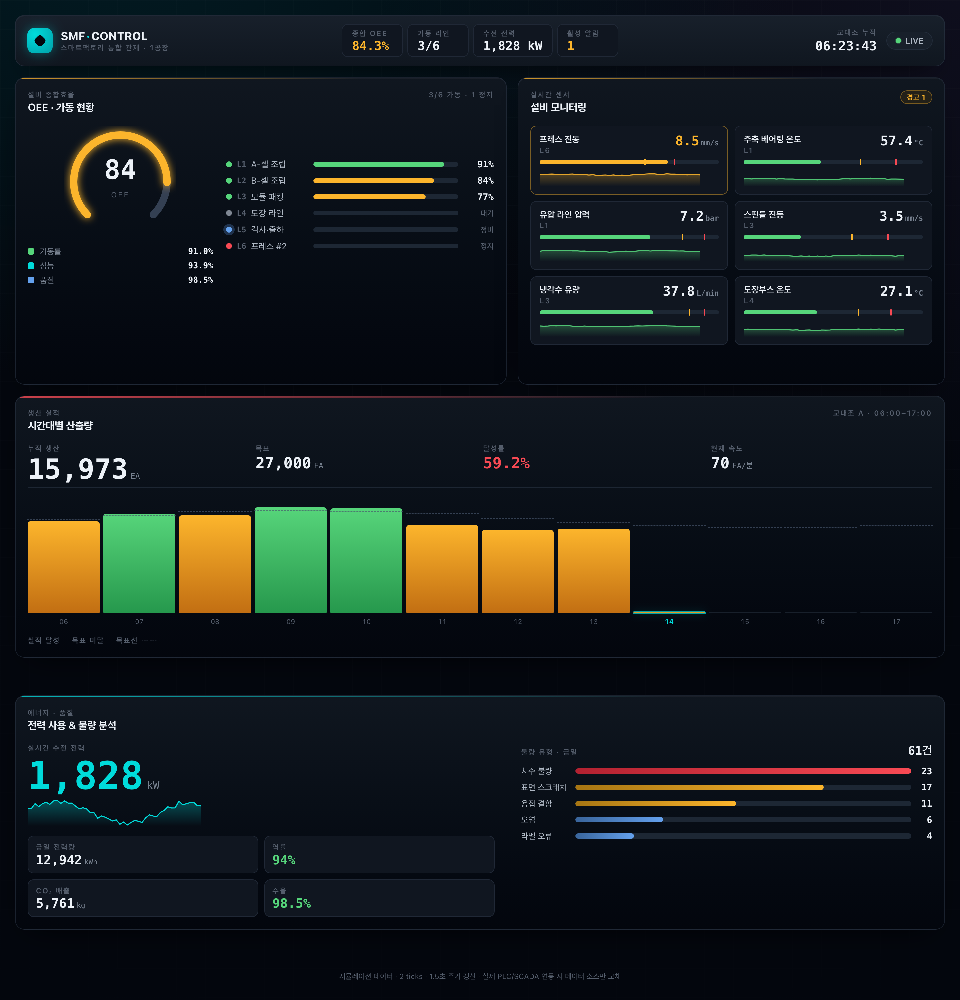

# SMF · 스마트팩토리 통합 관제 대시보드

설비 가동률(OEE) · 생산 실적 · 센서 모니터링 · 에너지/품질을 **하나의 컨트롤룸 화면**에서
실시간으로 관제하는 대시보드입니다. React + Vite + TypeScript로 작성되었고,
의존성 없이 SVG로 직접 그린 차트로 구성해 번들이 가볍습니다(JS ~52 kB gzip).



> 위 이미지는 실제 화면을 헤드리스 Chrome으로 캡처한 것입니다. 데이터는 1.5초마다 갱신됩니다.

---

## ✨ 주요 기능

| 패널 | 내용 |
|------|------|
| **OEE · 가동 현황** | 270° 레이디얼 게이지(가동률 × 성능 × 품질), 라인 6개 상태등(`가동/대기/정비/정지`)과 개별 OEE 바 |
| **생산 실적** | 시간대별 실적 대비 목표 막대(달성=초록 / 미달=호박색 / 현재 시간 하이라이트), 누적·목표·달성률·속도 지표 |
| **센서 모니터링** | 온도·압력·진동·유량 센서, 경고/위험 임계치 마커가 있는 게이지 + 스파크라인, 위험 시 패널 호흡 효과 + 위험순 자동 정렬 |
| **에너지 · 품질** | 실시간 수전 전력 + 48포인트 추이, 전력량·역률·CO₂·수율, 불량 유형 분포 바 |

- 상단 바: 종합 OEE / 가동 라인 / 수전 전력 / 활성 알람 + 교대조 누적 시간 + `LIVE` 일시정지 토글
- 다크 컨트롤룸 비주얼: OKLCH 디자인 토큰, 스캔 그리드 텍스처, 인스트루먼트 시안 액센트
- 접근성: 시맨틱 HTML, `prefers-reduced-motion` 대응, compositor-friendly 애니메이션만 사용
- 반응형: 1080px 이하에서 1열로 전환

---

## 🚀 빠른 시작 (미리보기)

```bash
# 1. 의존성 설치
npm install

# 2. 개발 서버 실행
npm run dev
```

브라우저에서 **http://localhost:5180** 을 열면 됩니다.
화면은 1.5초마다 자동 갱신되며, 우측 상단 `LIVE` 버튼으로 일시정지할 수 있습니다.

### 프로덕션 빌드

```bash
npm run build     # 타입 체크(tsc) + Vite 빌드 → dist/
npm run preview   # 빌드 결과 미리보기
```

---

## 🖼️ 미리보기 이미지 다시 생성하기

`docs/preview.png` 는 개발 서버를 띄운 상태에서 설치된 Chrome으로 캡처합니다.

```bash
# 터미널 1 — 개발 서버
npm run dev

# 터미널 2 — 스크린샷 캡처 (macOS / Google Chrome 기준)
"/Applications/Google Chrome.app/Contents/MacOS/Google Chrome" \
  --headless=new --disable-gpu --hide-scrollbars \
  --force-device-scale-factor=2 --window-size=1440,1500 \
  --virtual-time-budget=4500 \
  --screenshot=docs/preview.png "http://localhost:5180/"
```

- `--window-size` 로 캡처 영역(폭,높이)을 조절합니다.
- `--force-device-scale-factor=2` 는 레티나(2x) 해상도로 저장합니다.
- `--virtual-time-budget` 은 JS 렌더가 끝나도록 기다리는 시간(ms)입니다.

---

## 🧱 프로젝트 구조

```text
src/
├── lib/
│   ├── types.ts          # 도메인 타입 (라인/센서/생산/에너지)
│   ├── mockData.ts        # 시드 데이터 + 순수 함수 stepFactoryState (random walk)
│   └── format.ts          # 숫자/시간 포맷, clamp, drift 유틸
├── hooks/
│   └── useFactorySimulation.ts   # 1.5초 틱, 탭 숨김 시 자동 정지
├── components/
│   ├── layout/            # TopBar, shell.css
│   ├── ui/                # Panel, StatusDot (+ ui.css)
│   ├── charts/            # RadialOEE, Sparkline, BarTrend, SensorMeter (SVG)
│   ├── oee/               # OeePanel
│   ├── production/        # ProductionPanel
│   ├── sensors/           # SensorPanel
│   └── energy/            # EnergyQualityPanel
├── styles/
│   ├── tokens.css         # OKLCH 디자인 토큰
│   └── global.css         # 전역 스타일 + 배경 텍스처
├── App.tsx                # 패널 조합 + 집계 로직
└── main.tsx               # React 진입점
```

---

## 🔌 실제 설비 데이터 연동

현재 데이터는 `useFactorySimulation` 훅이 생성하는 **시뮬레이션 목업**입니다.
실제 PLC / SCADA / MES 연동 시에는 **데이터 소스만 교체**하면 UI는 그대로 재사용됩니다.

```ts
// useFactorySimulation 내부의 setState 갱신부를 실제 소스로 교체
//  - WebSocket 구독 → setState(serverState)
//  - 또는 REST 폴링 → fetch().then(setState)
// FactoryState 타입(src/lib/types.ts)만 맞춰 보내주면 됩니다.
```

---

## 📦 기술 스택 & 번들

- **React 18 · Vite 5 · TypeScript (strict)**
- 차트 라이브러리 **무의존** — 전부 인라인 SVG
- 번들: JS ≈ 159 kB (gzip 52 kB), CSS gzip 4 kB — 앱 페이지 예산 내

## 🧪 스크립트

| 명령 | 설명 |
|------|------|
| `npm run dev` | 개발 서버 (http://localhost:5180) |
| `npm run build` | 타입 체크 + 프로덕션 빌드 |
| `npm run preview` | 빌드 결과 로컬 서빙 |

## 🚀 배포 (Vercel)

GitHub 레포가 Vercel에 연동되어 있습니다.

**🔗 배포 URL: https://a001-smart-factory-dashboard.vercel.app** — 위 주소로 접속하면 배포된 대시보드를 바로 확인할 수 있습니다.

**데이터 소스**
- **설비 KPI · 센서 · 생산 · 에너지**: 브라우저 내 시뮬레이션 (실제 공장 OT/MES 데이터는 비공개 → 데모용 모의 데이터)
- **공장 외기 모니터링**: [Open-Meteo](https://open-meteo.com) **실측 데이터** (API 키 불필요, 60초 주기 폴링). 부지 좌표는 `src/lib/openMeteo.ts`의 `SITE_LOCATION`에서 변경

- `main` push → **Production** 자동 배포
- PR 생성 → **Preview** 배포 자동 생성 (PR에 미리보기 URL 코멘트)
- 빌드/헤더 설정은 레포 루트 `vercel.json`에서 관리 (Vite 프리셋 · CSP · 보안 헤더 · 자산 캐싱)
